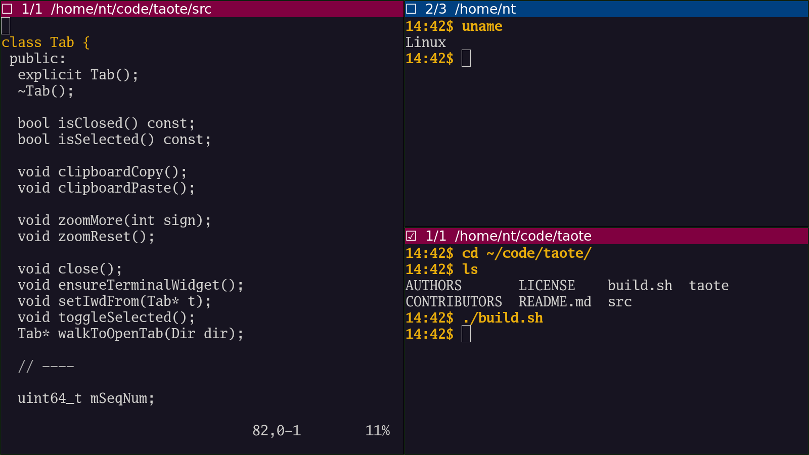

Taote is *The Acutely Opinionated Terminal Emulator*. It is minimalist and
keyboard-driven.

It's like the [GNOME Terminal
Emulator](https://github.com/GNOME/gnome-terminal) with less UI and fewer
features. The tab bar is smaller (but always present, so there's no jarring
motion when going between 1 and 2 tabs), as tab switching is only via keyboard
and not via mouse. There is no scrollbar visible (but the scroll wheel is still
supported).

It does have one additional feature: a simple keyboard shortcut
(Control-Shift-< or Control-Shift->) will cycle through tab bar colors. Even if
multiple terminal windows all show walls of text content, it's relatively easy
to pick out e.g. "the red terminal window" or "the blue terminal window".

Taote is designed to be used together with [The Acutely Opinionated Window
Manager](https://github.com/nigeltao/taowm).

